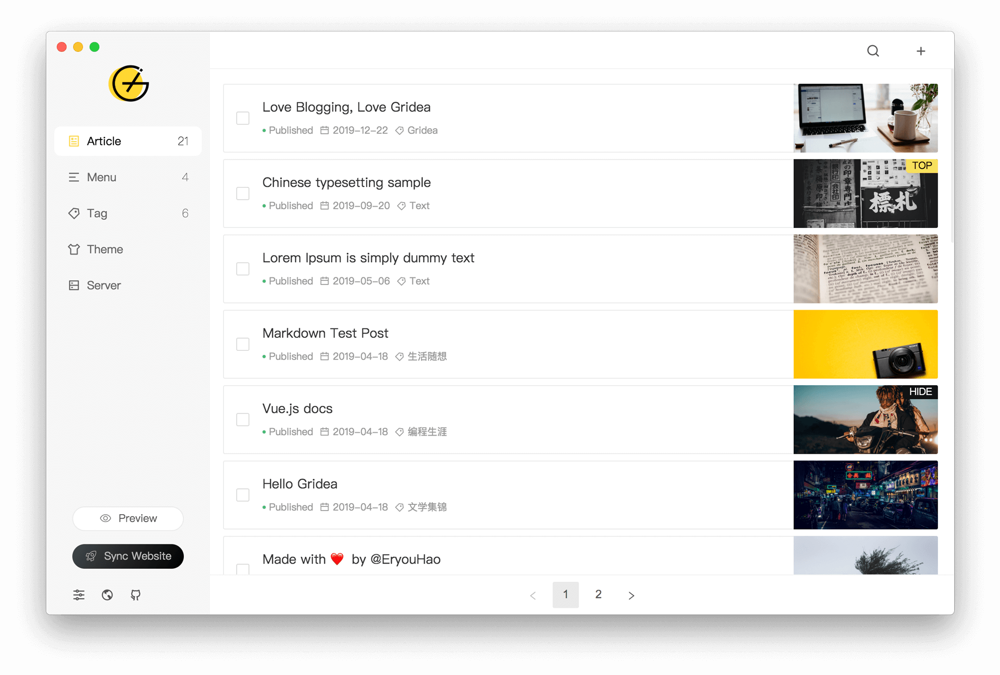

<!--
 * @Author: yquanmei
 * @Date: 2022-02
 * @LastEditors: yquanmei
 * @LastEditTime: 2022-02
-->
<div align="center">
  <h1 align="center">
    aSuncat博客搭建桌面端
  </h1>
  <h3 align="center">
    博客地址：<a href="https://yquanmei.github.io">每月一本书</a>
  </h3>
</div>

<div align="center">
  

</div>

English | [简体中文](https://github.com/getgridea/gridea/blob/master/README-zh_CN.md) | [繁體中文](https://github.com/getgridea/gridea/blob/master/README-zh_TW.md)

**[CHANGELOG](https://github.com/getgridea/gridea/blob/master/CHANGELOG.md)**

👏 Welcome to use **Gridea** ！

✍️ **Gridea** A static blog writing client. You can use it to record your life, mood, knowledge, notes and ideas...

## Features👇

📝 Use the coolest **Markdown** grammar to create quickly

🌉 Insert pictures and article cover charts anywhere in the article

🏷️ Label and group articles

📋 Customize menus and even create external link menus

💻 Use this client on **Windows** or **MacOS** or **Linux**

🌎 Use **Github Pages** or **Coding Pages** to show the world that more platforms will be supported in the future

💬 Simply configure and access the [Gitalk](https://github.com/gitalk/gitalk) or [DisqusJS](https://github.com/SukkaW/DisqusJS) comment system

🇬🇧 Use **simplified Chinese**、**traditional Chinese**、 **English**

🌁 Use any default theme within the application or any third-party theme, free theme customization

🖥 Customize the source folder and synchronize multiple devices using OneDrive, iCloud, Dropbox, etc.

🌱 Of course **Gridea** is still very young and has many shortcomings, but please believe it will keep moving forward 🏃

In the future, it will surely become your inseparable partner

Give full play to your talents！

😘 Enjoy~

## Development

If you want to contribute code, please check the [Contribution Guide](https://github.com/getgridea/gridea/wiki/%E8%B4%A1%E7%8C%AE%E6%8C%87%E5%8D%97) in advance.

```shell
$ # Node version > v10.0.0 is requied
$ git clone https://github.com/getgridea/gridea.git
$ cd gridea
$ yarn
$ yarn electron:serve
$ yarn electron:build
```

## 更新记录

- 20220225：添加作者信息
